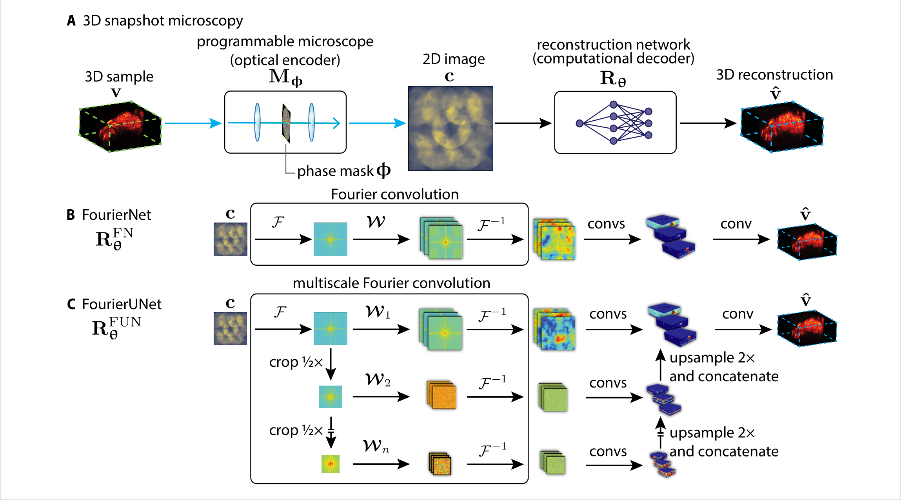
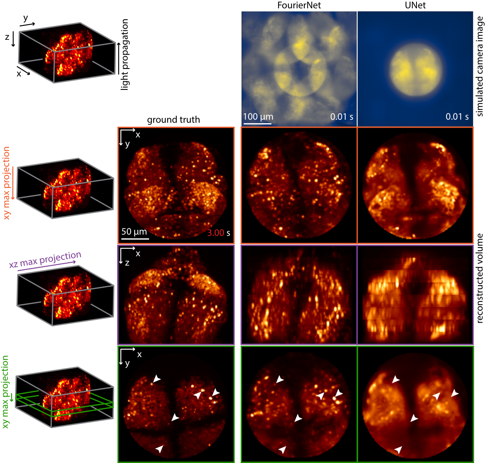
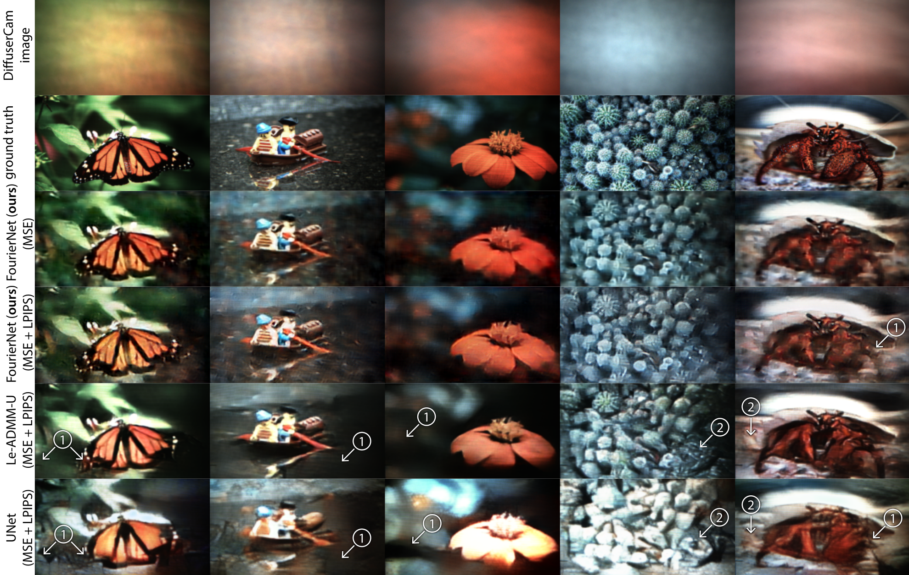

# Fourier Convolutions

This repository contains official PyTorch code for implementing Fourier convolutions and FourierNets/FourierUNets from the paper: [*Programmable 3D snapshot microscopy with Fourier convolutional networks*](https://arxiv.org/abs/2104.10611).





We include a pytorch implementation of
* Fourier convolutions and multiscale Fourier convolutions
* FourierNets and FourierUNets

We include a Jax implementation of
* Fourier convolutions
* FourierNets

The Pytorch and Jax implementations are slightly different; the Jax version is faster, the pytorch version has a few more features. 

What is **not** included:

* Scripts to recreate experiments from the paper. If you want to reproduce those experiments, you can obtain training/testing code from [TuragaLab/snapshotscope](https://github.com/TuragaLab/snapshotscope).
* This repository does **not** contain the simulation code required to run the experiments. The simulation package can be obtained from [TuragaLab/snapshotscope](https://github.com/TuragaLab/snapshotscope).
* This repository does **not** include the data required to run the experiments. The data can be obtained from [Figshare](https://figshare.com) (coming soon).

# Installation

There are two steps to installation, depending on whether you are interested in only the Fourier convolution implementations or also the simulation package required to run the experiment scripts. Either way, first make sure that you've installed [PyTorch](https://pytorch.org) or [Jax](https://github.com/google/jax#installation) and its necessary dependencies for your device. 

## Installing Fourier convolutions/FourierNet/FourierUNet

We have tested `fouriernet` on Python 3.7 with PyTorch 1.7. Newer versions of PyTorch will remove the old FFT interface, and cause this software to fail.

To install only the Fourier convolution architectures contained in this package, you can simply:

```
pip install git+https://github.com/TuragaLab/fouriernet
```

## Installing simulation library

We have tested `snapshotscope` on Python 3.7 with PyTorch 1.7. Newer versions of PyTorch will remove the old FFT interface, and cause this software to fail.

To install the simulation library (required for running the experiment scripts), you can run:

```
pip install git+https://github.com/TuragaLab/snapshotscope
```
